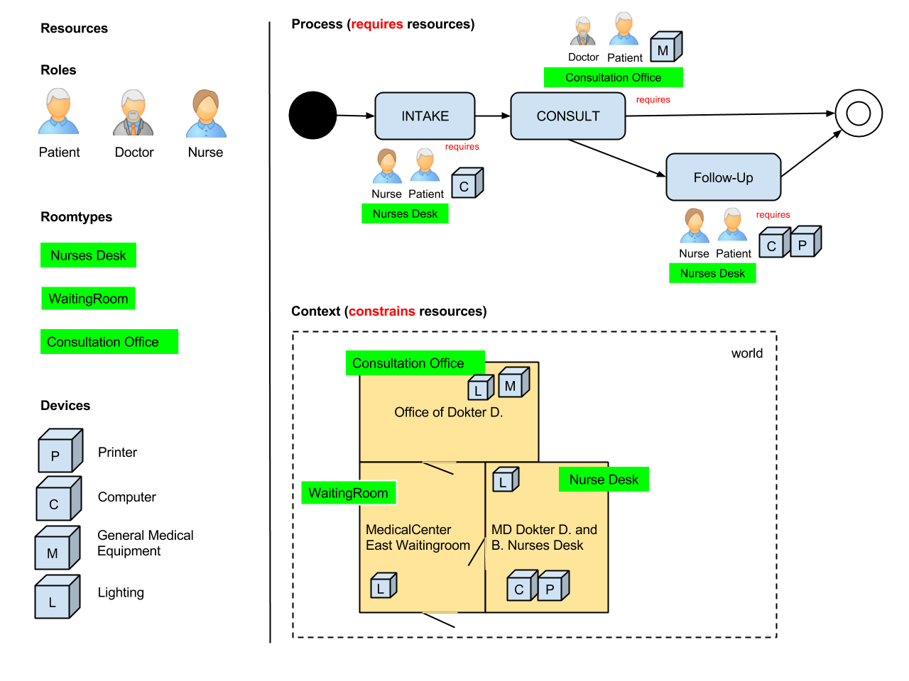

#Simple Example

## A simplified MD's office

The drawing above provides an archetypical example of a MD’s office being modelled as use case in ASIMOV.
Where just a simple process of the agent visiting the MD practice and optionally schedule a next appointment afterwards is described. 

The resources are observable and thus a-priori assets of the investigation.

The context holds (meta-)physical constraints. In this case this is the building (rooms, doors and devices) and the fact that the people fulfilling the roles are starting outside of the building.

The process references to the types of resources required given that the constraints from the context are and will be met.

TODO: explain how to transform this to input xml.